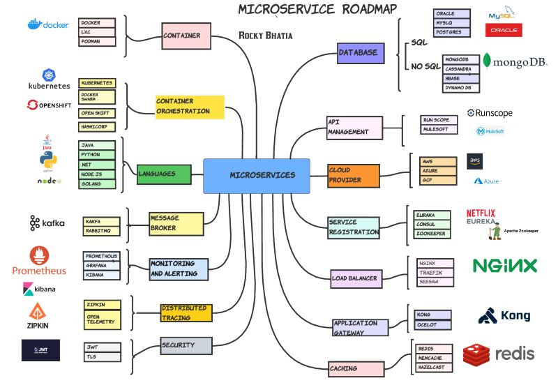

#### Microservices

Companies like Netflix, Amazon, and others have adopted the concept of microservices in their products due to large benefits offered by microservices.

As we understand, many developers want to know how they should start this journey. So I decided to make this journey clearer by defining a road map for this learning curve.

**Container** - A container is a standard unit of software that packages up code and all its dependencies so the application runs quickly and reliably from one computing environment to another.

**Container orchestration** automates containers' deployment, management, scaling, and networking. Enterprises that need to deploy and manage hundreds or thousands of Linux® containers and hosts can benefit from container orchestration.

**Load balancer** is a device that acts as a reverse proxy and distributes network or application traffic across several servers.
Load balancers are used to increase the capacity (concurrent users) and reliability of applications. 
 
**Monitoring and Alerting**: In a microservice architecture, if you want to have a reliable application or service, you have to monitor the functionality, performance, communication, and any other aspect of your application in order to achieve a responsible application. Promethous is widely popular.

**Distributed Tracing** - when it comes to microservice architecture, a request may be passed through different services, which makes it difficult to debug and trace because the codebase is not in one place, so here distributed tracing tool can be helpful.

**Message Broker** - A message broker is software that facilitates the exchange of messages between applications, systems, and services.

**Database** - in most systems, we need to persist data, because we would need the data for further processes or reporting, etc.

**Caching** - Caching reduces latency in service-to-service communication of microservice architectures.

**Cloud service provider** - is a third-party company offering a cloud-based platform, infrastructure, application, or storage services.

**API Management**: API management is the process of designing, publishing, documenting, and analyzing APIs in a secure environment. 

**Application Gateway** - An application gateway or application level gateway (ALG) is a firewall proxy that provides network security. It filters incoming node traffic to certain specifications, meaning only transmitted network application data is filtered.

**Service Registration** - A service registry is a database used to keep track of the available instances of each microservice in an application. The service registry needs to be updated each time a new service comes online and whenever a service is taken offline or becomes unavailable.

Credits to [LinkedIn Post](https://www.linkedin.com/feed/update/urn:li:activity:7008442011582107648?utm_source=share&utm_medium=member_desktop)   

**Load balancer algorithms:**
- Load balancers can route traffic based on various metrics like least-busy, random, round-robin, sticky, etc.

#### Learn Microservices
1. Microservices Architecture Basics: Monolithic vs. Microservices, characteristics (independence, scalability, resilience), and designing microservices boundaries (DDD-Domain-Driven Design)
2. Service Communication: Synchronous (REST, gRPC) vs. Asynchronous (Message Queues), API design and versioning, event-driven architecture, and event sourcing
3. Data Management: Database per service, distributed data management (saga pattern, 2PC, CQRS), and handling data consistency across services
4. Deployment Strategies: Containerization (Docker), orchestration (Kubernetes), and service discovery and registry (Eureka, Consul)
5. Frameworks and Tools: Spring Boot (Spring Cloud for microservices), Micronaut, Quarkus, or Dropwizard as alternatives
6. Communication Protocols: RESTful APIs and gRPC, messaging systems (Kafka, RabbitMQ)
7. Databases: SQL (PostgreSQL, MySQL), NoSQL (MongoDB, Cassandra), and distributed caching (Redis, Memcached)
8. CI/CD Pipelines: Tools like Jenkins, GitHub Actions, GitLab Cl, and deployment strategies like Blue-Green and Canary deployments
9. Infrastructure as Code: Terraform, Ansible, or AWS CloudFormation
10. Logging and Monitoring: Centralized logging (ELK Stack, Splunk) and monitoring tools (Prometheus, Grafana)
11. Resilience and Fault Tolerance: Circuit Breaker (Hystrix, Resilience4j), Bulkhead pattern, and retries
12. Security: OAuth2, OpenID Connect, and API Gateways (Zuul, Spring Cloud Gateway, Kong)
13. Testing Microservices: Unit and integration testing, contract testing (Pact), and end-to-end testing
14. Scalability Patterns: Horizontal and vertical scaling, load balancing (HAProxy, NGINX)
15. Distributed Tracing: Tools like Jaeger and Zipkin
16. Anti-Patterns: Avoiding distributed monoliths and over-engineering microservices

